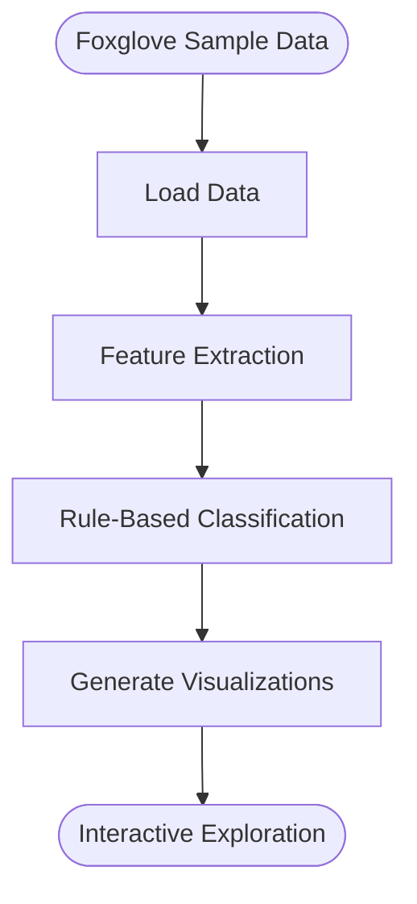

# Data Visualization: Autonomous Driving Scene Analysis Using Waymo Samples

## Table of Contents
- [Project Overview](#project-overview)
- [Project Architecture](#project-architecture)
- [Installation and Setup](#installation-and-setup)
- [Data Preparation](#data-preparation)
- [Technical Implementation](#technical-implementation)
  - [Data Processing](#data-processing)
  - [Scene Classification](#scene-classification)
  - [Visualization](#visualization)
- [Code Structure](#code-structure)
- [Usage Guide](#usage-guide)
- [Project Contributions](#project-contributions)
- [Resources and References](#resources-and-references)

## Project Overview

This project utilizes sample data from the Waymo Open Dataset via Foxglove Studio to develop interactive data visualization tools for analyzing autonomous driving scenes. The primary goal is to create intuitive visualizations that enhance understanding of various driving scenarios, such as urban, suburban, or nighttime scenes. By focusing on visualization design and using pre-existing sample data, this project simplifies a complex framework for use in a data visualization course with limited resources.

## Project Architecture

The project adopts a simplified modular architecture:



- **Data Loading**: Directly accesses sample data from Foxglove Studio.
- **Feature Extraction**: Extracts key scene features for classification and visualization.
- **Rule-Based Classification**: Applies simple rules to categorize scenes.
- **Visualization Generation**: Produces statistical plots and interactive displays.

## Installation and Setup

### Prerequisites

- Python 3.8 or higher
- Git
- Foxglove Studio
- Basic storage space (no large dataset downloads required)

### Installation Steps

1. **Clone the Repository**:
   ```bash
   git clone https://github.com/Rongxuan-Zhou/Scene-Visualization-Waymo-Samples.git
   cd Scene-Visualization-Waymo-Samples
   ```

2. **Create and Activate Conda Environment**:
   ```bash
   conda create -n waymo-scene python=3.8
   conda activate waymo-scene
   ```

3. **Install Dependencies**:
   ```bash
   conda install -c conda-forge numpy pandas matplotlib seaborn
   pip install -r requirements.txt
   ```

4. **Install Foxglove Studio**:
   Download and install from the [Foxglove Download Page](https://foxglove.dev/download).

## Data Preparation

This project uses **Foxglove Sample Data**, eliminating the need for downloading or processing large datasets:

1. Open Foxglove Studio.
2. Access the [Waymo Example](https://app.foxglove.dev/~/view?ds=foxglove-sample-stream&ds.recordingId=rec_0dHYwkGj9g7eA9DE&ds.overrideLayoutId=df51964b-b84a-4e12-a11e-067e2fce9c1c).
3. Load the sample data to begin analysis and visualization.

This method ensures quick setup and seamless integration with visualization tools.

## Technical Implementation

### Data Processing

The data processing module extracts essential features from the sample data, such as time of day, location, and weather, to support classification and visualization:

```python
def extract_features(frame):
    return {
        'time_of_day': frame.context.stats.time_of_day,
        'location': frame.context.stats.location,
        'weather': frame.context.stats.weather
    }
```

### Scene Classification

A rule-based classification approach is employed to categorize scenes based on the extracted features, reducing computational demands:

```python
def classify_scene_rule_based(features):
    # Time classification
    time_class = 'unknown'
    if features['time_of_day'] in ['DAWN', 'DUSK']:
        time_class = 'low_light'
    elif features['time_of_day'] == 'DAY':
        time_class = 'daytime'
    elif features['time_of_day'] == 'NIGHT':
        time_class = 'nighttime'

    # Location classification
    location_class = 'unknown'
    if features['location'] == 'LOCATION_SF':
        location_class = 'urban'
    elif features['location'] == 'LOCATION_PHX':
        location_class = 'suburban'

    # Weather classification
    weather_class = 'unknown'
    if features['weather'] == 'SUNNY':
        weather_class = 'clear'
    elif features['weather'] in ['RAIN', 'FOG']:
        weather_class = 'adverse'

    return {
        'time_class': time_class,
        'location_class': location_class,
        'weather_class': weather_class
    }
```

### Visualization

The visualization module generates statistical plots to display scene distributions, emphasizing clarity and efficiency in design:

```python
import matplotlib.pyplot as plt
import seaborn as sns

def create_scene_distribution_plots(df):
    fig, axes = plt.subplots(1, 3, figsize=(15, 5))

    # Time distribution
    sns.countplot(x='time_class', data=df, ax=axes[0])
    axes[0].set_title('Time Classes')
    axes[0].set_xlabel('')
    axes[0].set_ylabel('Count')

    # Location distribution
    sns.countplot(x='location_class', data=df, ax=axes[1])
    axes[1].set_title('Location Classes')
    axes[1].set_xlabel('')
    axes[1].set_ylabel('Count')

    # Weather distribution
    sns.countplot(x='weather_class', data=df, ax=axes[2])
    axes[2].set_title('Weather Classes')
    axes[2].set_xlabel('')
    axes[2].set_ylabel('Count')

    plt.tight_layout()
    plt.savefig('scene_distributions.png')
    plt.close()
```

## Code Structure

The project code is organized clearly for ease of management and extension:

```
Scene-Visualization-Waymo-Samples/
├── data/                      # Sample data storage
│   └── foxglove_samples/      # Foxglove sample data (if downloaded)
├── scripts/                   # Utility scripts
│   └── visualization/         # Visualization scripts
├── src/                       # Source code
│   ├── data_processing/       # Data processing modules
│   ├── classification/        # Classification modules
│   └── visualization/         # Visualization modules
├── notebooks/                 # Jupyter notebooks for demonstrations
├── tests/                     # Unit tests
├── requirements.txt           # Python dependencies
├── setup.py                   # Project setup script
└── README.md                  # Project documentation
```

## Usage Guide

### Basic Usage

```python
from src.data_processing import extract_features
from src.classification import classify_scene_rule_based
from src.visualization import create_scene_distribution_plots
import pandas as pd

# Load sample data (pseudo-code; implementation depends on Foxglove integration)
frames = load_sample_data()
features_list = [extract_features(frame) for frame in frames]
classified = [classify_scene_rule_based(f) for f in features_list]
df = pd.DataFrame(classified)

# Generate visualizations
create_scene_distribution_plots(df)
```

### Using with Foxglove Studio

1. Open Foxglove Studio.
2. Load the [Waymo sample data](https://app.foxglove.dev/~/view?ds=foxglove-sample-stream&ds.recordingId=rec_0dHYwkGj9g7eA9DE&ds.overrideLayoutId=df51964b-b84a-4e12-a11e-067e2fce9c1c).
3. Explore the data interactively, complemented by Python-generated visualizations.

## Project Contributions

This project contributes to the field of data visualization by:

1. **Visualization Design**: Developing intuitive visualizations for autonomous driving scenes to enhance interpretability of complex data.
2. **Resource Adaptation**: Adapting a complex project to limited resources using sample data and simplified methods.
3. **Interactive Exploration**: Supporting dynamic scene analysis through Foxglove Studio and statistical plots.
4. **Scalability**: Designing visualizations that can be extended to larger datasets with additional resources, demonstrating future applicability.

These contributions highlight the project's value in data visualization education and practice.

## Resources and References

- **Data Resources**:
  - [Waymo Open Dataset](https://waymo.com/open/)
- **Visualization Tools**:
  - [Foxglove Studio Documentation](https://docs.foxglove.dev/docs)
  - [Matplotlib Documentation](https://matplotlib.org/)
  - [Seaborn Documentation](https://seaborn.pydata.org/)
