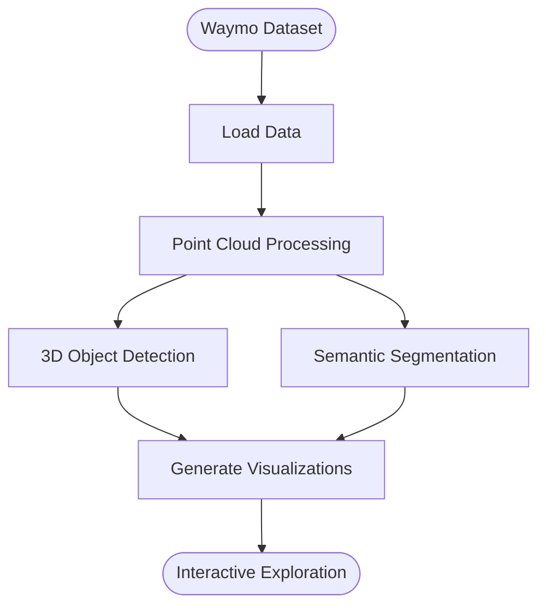

# Visualization Demo of Autonomous Driving Scene Analysis Using Waymo Dataset

## Table of Contents
- [Project Overview](#project-overview)
- [Project Architecture](#project-architecture)
- [Installation and Setup](#installation-and-setup)
- [Data Preparation](#data-preparation)
- [Technical Implementation](#technical-implementation)
  - [Data Processing](#data-processing)
  - [Scene Classification](#scene-classification)
  - [Visualization](#visualization)
- [Methodological Framework](#methodological-framework)
  - [Dataset Structure and Access](#dataset-structure-and-access)
  - [Point Cloud Processing](#point-cloud-processing)
  - [3D Object Detection](#3d-object-detection)
  - [Semantic Segmentation](#semantic-segmentation)
- [Code Structure](#code-structure)
- [Usage Guide](#usage-guide)
- [Project Contributions](#project-contributions)
- [Resources and References](#resources-and-references)

## Project Overview

This project utilizes data from the Waymo Open Dataset via Foxglove Studio to develop interactive data visualization tools for analyzing autonomous driving scenes. The primary goal is to create intuitive visualizations that enhance understanding of various driving scenarios, such as urban, suburban, or nighttime scenes.

## Methodological Framework

### Dataset Structure and Access

This project utilizes the Waymo Open Dataset, which consists of two main components:
- **Perception Dataset**: Contains high-resolution sensor data and annotations from 1,950 segments, each 20 seconds long
- **Motion Dataset**: Contains object trajectories and corresponding 3D maps from 103,354 segments, each 20 seconds long



Each segment is a sequence of frames ordered by the frame start timestamp, containing data from multiple sensors:

```python
# Example: Accessing and loading the Waymo dataset
import tensorflow as tf
from waymo_open_dataset import dataset_pb2
from waymo_open_dataset.utils import frame_utils

# Load data
def load_waymo_segment(filename):
    dataset = tf.data.TFRecordDataset(filename, compression_type='')
    for data in dataset:
        frame = dataset_pb2.Frame()
        frame.ParseFromString(bytearray(data.numpy()))
        yield frame
```

### Point Cloud Processing

The Waymo dataset provides rich LiDAR point cloud data that can be processed as follows:

```python
# Convert raw point cloud data to a visualization format
def convert_range_image_to_point_cloud(frame, range_images, camera_projections, range_image_top_pose):
    """
    Generate point cloud from range images
    """
    points, cp_points = frame_utils.convert_range_image_to_point_cloud(
        frame,
        range_images,
        camera_projections,
        range_image_top_pose
    )
    return points, cp_points
```

Point cloud visualization is implemented using the Open3D library:

```python
import numpy as np
import open3d as o3d

def visualize_point_cloud(points):
    """
    Visualize point cloud using Open3D
    """
    pcd = o3d.geometry.PointCloud()
    pcd.points = o3d.utility.Vector3dVector(points)
    o3d.visualization.draw_geometries([pcd])
```

### 3D Object Detection

Processing 3D bounding boxes from the Waymo dataset:

```python
from waymo_open_dataset.label_pb2 import Label
from waymo_open_dataset.utils import transform_utils

def transform_bbox_waymo(label: Label) -> np.ndarray:
    """
    Transform an object's 3D bounding box using Waymo tools
    """
    heading = -label.box.heading
    bbox_corners = get_bbox(label)
    mat = transform_utils.get_yaw_rotation(heading)
    rot_mat = mat.numpy()[:2, :2]
    return bbox_corners @ rot_mat

def get_bbox(label: Label) -> np.ndarray:
    width, length = label.box.width, label.box.length
    return np.array([
        [-0.5 * length, -0.5 * width],
        [-0.5 * length, 0.5 * width],
        [0.5 * length, -0.5 * width],
        [0.5 * length, 0.5 * width]
    ])
```

### Semantic Segmentation

This project implements 3D semantic segmentation functionality based on the Waymo dataset, using the following method to process point cloud labels:

```python
def process_point_cloud_with_labels(frame):
    """
    Process point cloud and its semantic labels
    """
    # Get point cloud data
    (range_images, camera_projections, _, range_image_top_pose) = \
        frame_utils.parse_range_image_and_camera_projection(frame)
    
    # Convert to point cloud
    points, cp_points = convert_range_image_to_point_cloud(
        frame, range_images, camera_projections, range_image_top_pose)
    
    # Extract semantic labels
    point_labels = extract_point_labels(frame, points)
    
    return points, point_labels
```

## Installation and Setup

### Prerequisites

- Python 3.8 or higher
- TensorFlow 2.5+
- Git
- Foxglove Studio
- Open3D (for point cloud visualization)
- Basic storage space (only sample data required for the demo)

### Installation Steps

1. **Clone the Repository**:
   ```bash
   git clone https://github.com/Rongxuan-Zhou/Scene-Visualization-Waymo-Demo.git
   cd Scene-Visualization-Waymo-Demo
   ```

2. **Create and Activate Conda Environment**:
   ```bash
   conda create -n waymo-viz python=3.8
   conda activate waymo-viz
   ```

3. **Install Dependencies**:
   ```bash
   pip install waymo-open-dataset-tf-2-11-0
   pip install tensorflow==2.11.0
   pip install open3d matplotlib seaborn numpy pandas
   pip install -r requirements.txt
   ```

4. **Install Foxglove Studio**:
   Download and install from the [Foxglove Download Page](https://foxglove.dev/download).

## Data Preparation

The Waymo Open Dataset can be accessed through the following methods:

1. **Direct Download**:
   Download the dataset from the [Waymo Open Dataset website](https://waymo.com/open/data/).
   
2. **Loading with TensorFlow**:
   ```python
   import tensorflow as tf
   from waymo_open_dataset.utils import frame_utils
   
   # Load TFRECORD file
   def load_waymo_data(tfrecord_path):
       dataset = tf.data.TFRecordDataset(tfrecord_path, compression_type='')
       return dataset
   ```

3. **Via Foxglove Studio**:
   Open Foxglove Studio and load the Waymo dataset examples.

## Usage Guide

### Basic Usage

```python
# Load and process Waymo data
from src.data_processing import load_waymo_segment, extract_features
from src.classification import classify_scene
from src.visualization import create_visualizations
import pandas as pd

# Load Waymo dataset
frames = list(load_waymo_segment('path/to/segment.tfrecord'))
features_list = [extract_features(frame) for frame in frames]
classified = [classify_scene(f) for f in features_list]
df = pd.DataFrame(classified)

# Generate visualizations
create_visualizations(frames, df)
```

### Point Cloud Visualization Example

```python
import numpy as np
import open3d as o3d
from waymo_open_dataset.utils import frame_utils

def visualize_frame_point_cloud(frame):
    # Parse point cloud data
    (range_images, camera_projections, _, range_image_top_pose) = \
        frame_utils.parse_range_image_and_camera_projection(frame)
    
    # Convert to point cloud
    points, _ = frame_utils.convert_range_image_to_point_cloud(
        frame, range_images, camera_projections, range_image_top_pose)
    
    # Concatenate points from all LiDAR sensors
    points_all = np.concatenate(points, axis=0)
    
    # Visualize using Open3D
    pcd = o3d.geometry.PointCloud()
    pcd.points = o3d.utility.Vector3dVector(points_all)
    o3d.visualization.draw_geometries([pcd])
```

## Resources and References

- **Data Resources**:
  - [Waymo Open Dataset - Perception](https://waymo.com/open/data/perception/)
  - [Waymo GitHub Repository](https://github.com/waymo-research/waymo-open-dataset)
- **Tutorials**:
  - [Basic Tutorial Notebook](https://colab.research.google.com/github/waymo-research/waymo-open-dataset/blob/master/tutorial/tutorial.ipynb)
  - [3D Semantic Segmentation Tutorial](https://github.com/waymo-research/waymo-open-dataset/blob/master/tutorial/tutorial_3d_semseg.ipynb)
  - [Motion Prediction Tutorial](https://github.com/waymo-research/waymo-open-dataset/blob/master/tutorial/tutorial_motion.ipynb)
- **Visualization Tools**:
  - [Foxglove Studio Documentation](https://docs.foxglove.dev/docs)
  - [Open3D Documentation](http://www.open3d.org/docs/release/)
