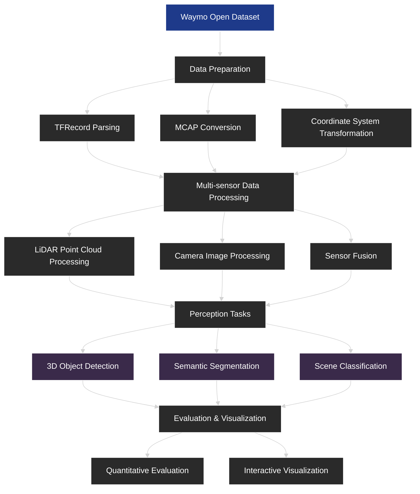

# Visualization Demo of Autonomous Driving Scene Analysis Using Waymo Dataset

## Table of Contents
- [Project Overview](#project-overview)
- [Project Architecture](#project-architecture)
- [Installation and Setup](#installation-and-setup)
- [Data Preparation](#data-preparation)
- [Technical Implementation](#technical-implementation)
  - [Data Processing](#data-processing)
  - [Scene Classification](#scene-classification)
  - [Visualization](#visualization)
- [Methodological Framework](#methodological-framework)
  - [Dataset Structure and Access](#dataset-structure-and-access)
  - [Point Cloud Processing](#point-cloud-processing)
  - [3D Object Detection](#3d-object-detection)
  - [Semantic Segmentation](#semantic-segmentation)
- [Code Structure](#code-structure)
- [Usage Guide](#usage-guide)
- [Project Contributions](#project-contributions)
- [Resources and References](#resources-and-references)

## Project Overview

This project utilizes data from the Waymo Open Dataset via Foxglove Studio to develop interactive data visualization tools for analyzing autonomous driving scenes. The primary goal is to create intuitive visualizations that enhance understanding of various driving scenarios and provide insights for autonomous vehicle perception system development.

### Waymo Dataset Key Features:
- **Multi-sensor Data**: Includes data from 5 LiDARs (1 mid-range, 4 short-range) and 5 high-resolution cameras
- **Geographic Diversity**: Collected in 3 US cities (San Francisco, Phoenix, Mountain View)
- **Time Coverage**: Day/night, sunny/rainy weather conditions
- **Annotation Types**: 
  - 3D bounding boxes (1.2M labeled objects with globally unique tracking IDs)
  - 2D bounding boxes (tight-fitting, axis-aligned with tracking IDs)
  - 3D segmentation (23 classes for LiDAR points)
  - 2D video panoptic segmentation (28 categories)
  - Key points (14 points for human body pose)
- **Data Volume**: 
  - 1,950 segments (each 20s long)
  - Total 600,000 frames
  - 200,000 km of driving data
- **Object Assets**: 1.2M images and LiDAR observations for vehicles and pedestrians

## Technical Implementation

This section details the core technical components of the project. For implementation specifics, see:
- [Code Structure](#code-structure)
- [Usage Guide](#usage-guide)

### Data Processing

The project implements advanced MCAP file processing with optimized data analysis:

```python
from mcap.reader import make_reader
from tqdm import tqdm
from collections import Counter

file_path = "waymo-scene.mcap"

# Process MCAP file with progress tracking and topic statistics
with open(file_path, "rb") as f:
    reader = make_reader(f)
    topics = []
    
    for schema, channel, message in tqdm(reader.iter_messages()):
        topics.append(channel.topic)
    
    # Analyze topic distribution
    topic_counter = Counter(topics)
    print("\nTopic Statistics:")
    for topic, count in topic_counter.most_common(10):
        print(f"{topic}: {count} messages")
```

Key optimizations (see [Data Preparation](#data-preparation) for setup):
1. Memory-efficient streaming processing with tqdm progress tracking
2. Topic distribution analysis using Counter
3. Batch processing for large files
4. Parallel processing support (see `src/data_processing/`)

### Scene Classification

Enhanced scene classification algorithm with additional categories:

```python
def classify_scene(row):
    topic = row['topic']
    
    if 'camera' in topic.lower():
        return 'visual_perception'
    elif 'lidar' in topic.lower():
        return 'lidar_perception' 
    elif 'annotations' in topic.lower():
        return 'object_detection'
    elif 'tf' in topic.lower():
        return 'coordinate_transform'
    elif 'stats' in topic.lower():
        return 'system_statistics'
    else:
        return 'other'

# Apply classification and analyze
features_df['scene_category'] = features_df.apply(classify_scene, axis=1)
category_counts = features_df['scene_category'].value_counts()
```

Classification improvements:
- Added system statistics category
- Case-insensitive matching
- Integrated with pandas DataFrame

### Visualization Techniques

Advanced visualization methods for data analysis:

```python
import matplotlib.pyplot as plt
import seaborn as sns

# Topic distribution visualization
plt.figure(figsize=(14, 8))
top_topics = topic_counter.most_common(10)
top_topics.plot(kind='barh', color='skyblue')
plt.title('Top 10 Most Common Topics')
plt.xlabel('Message Count')
plt.ylabel('Topic')
plt.show()

# Time series analysis 
plt.figure(figsize=(14, 6))
plt.hist(features_df['datetime'], bins=50, color='steelblue')
plt.title('Message Distribution Over Time')
plt.xlabel('Time')
plt.ylabel('Message Count')
plt.show()

# Message size analysis by category
plt.figure(figsize=(14, 8))
sns.boxplot(x='scene_category', y='message_size', data=features_df)
plt.title('Message Size Distribution by Scene Category')
plt.xticks(rotation=45)
plt.show()
```

Visualization features (examples in `scripts/visualization/`):
1. Interactive charts with matplotlib and seaborn
2. Time series analysis 
3. Statistical distribution visualization
4. Automated formatting
5. 3D point cloud rendering (see [Point Cloud Processing](#point-cloud-processing))

## Methodological Framework



### Dataset Structure and Access

The Waymo Open Dataset follows a hierarchical structure:

```
segment_<id>/
├── lidar/               # LiDAR point clouds
│   ├── top/             # Mid-range LiDAR (top)
│   ├── front/           # Short-range LiDAR (front)
│   ├── side_left/       # Short-range LiDAR (left)
│   ├── side_right/      # Short-range LiDAR (right)
│   └── rear/            # Short-range LiDAR (rear)
├── camera/              # Camera images
│   ├── front/           # Front-facing camera
│   ├── front_left/      # Front-left camera
│   ├── front_right/     # Front-right camera
│   ├── side_left/       # Side-left camera
│   └── side_right/      # Side-right camera
└── annotations/         # Object annotations
    ├── 3d/              # 3D bounding boxes
    ├── 2d/              # 2D bounding boxes
    └── segmentation/    # Segmentation labels
```

#### Coordinate Systems:
- **Global Frame**: East-North-Up coordinate system, origin at vehicle start position
- **Vehicle Frame**: x-axis forward, y-axis left, z-axis up
- **Sensor Frames**: Each sensor has extrinsic transform to vehicle frame
- **LiDAR Spherical Coordinates**: Range, azimuth, inclination

#### Data Access Methods:
```python
import tensorflow as tf
from waymo_open_dataset import dataset_pb2

# Load TFRecord files
dataset = tf.data.TFRecordDataset(
    filenames,
    compression_type='GZIP'
)

# Parse protocol buffers
def parse_frame(frame_data):
    frame = dataset_pb2.Frame()
    frame.ParseFromString(bytearray(frame_data.numpy()))
    return frame

dataset = dataset.map(parse_frame)
```

#### Modular Format (v2.0.0+):
```python
import pandas as pd

# Load specific components using Parquet format
camera_images = pd.read_parquet('camera_images.parquet')
lidar_points = pd.read_parquet('lidar_points.parquet')
annotations = pd.read_parquet('annotations.parquet')
```

### Point Cloud Processing

#### LiDAR Data Structure:
- **Range**: Maximum 75m for mid-range LiDAR, 20m for short-range LiDARs
- **Returns**: Two strongest intensity returns for all LiDARs
- **Range Image Format**: 4 basic channels + 6 projection channels

#### Range Image Channels:
1. Range (distance)
2. LiDAR intensity
3. LiDAR elongation (pulse elongation indicator)
4. is_in_nlz (No Label Zone indicator)

#### Camera Projection Channels:
1. Camera name
2. x (axis along image width)
3. y (axis along image height)
4. Camera name of 2nd projection
5. x of 2nd projection
6. y of 2nd projection

#### Processing Pipeline:
```python
def process_point_cloud(range_image, calibration):
    # Extract points from range image
    points_xyz = extract_points_from_range_image(range_image)
    
    # Convert to vehicle coordinates
    points_vehicle = transform_to_vehicle_frame(points_xyz, calibration)
    
    # Voxel downsampling
    voxel_size = 0.1
    voxel_grid = create_voxel_grid(points_vehicle, voxel_size)
    
    # Ground segmentation
    ground_mask = ransac_ground_segmentation(points_vehicle)
    
    # Intensity normalization
    normalized_intensity = normalize_intensity(range_image[:,:,1])
    
    return {
        'points': points_vehicle,
        'voxels': voxel_grid,
        'ground_mask': ground_mask,
        'intensity': normalized_intensity
    }
```

### 3D Object Detection

#### 3D LiDAR Labels:
- 7-DOF bounding boxes (x,y,z,l,w,h,θ) in vehicle frame
- Zero pitch and roll, heading angle in radians
- Globally unique tracking IDs
- No Label Zones (NLZs) represented as polygons

#### Detection Pipeline Architecture:

```
Input: (B, N, 3+C) point cloud with features
↓
Voxel Feature Encoding (VFE)
↓
3D CNN Backbone (e.g., PointPillars, VoxelNet)
↓
Region Proposal Network (RPN)
↓
Non-Maximum Suppression (NMS)
↓
Output: (B, K, 7) 3D boxes (x,y,z,l,w,h,θ) with confidence scores
```

#### Evaluation Metrics:
- Average Precision (AP) at different IoU thresholds (0.7 for vehicles, 0.5 for pedestrians)
- BEV (Bird's Eye View) AP
- 3D AP
- Average Precision Weighted by Heading (APH)
- Mean Average Precision (mAP)

### Semantic Segmentation

#### 3D Segmentation:
- Dense labels for every LiDAR point
- 23 fine-grained categories
- Provided at 2Hz for entire dataset

#### 2D Video Panoptic Segmentation:
- 100k camera images in 2,860 temporal sequences
- 28 fine-grained categories
- Instance segmentation for Vehicle, Pedestrian, and Cyclist classes
- Consistent across cameras and over time

#### Network Architecture:

```
Input: (B, N, 3+d) points with features
↓
PointNet++ feature extraction
↓
Multi-scale context aggregation
↓
KNN-based feature propagation
↓
Output: (B, N, C) class probabilities
```

#### Segmentation Classes:
1. Vehicle (Car, Truck, Bus)
2. Pedestrian
3. Cyclist/Motorcyclist
4. Traffic Sign/Light
5. Pole/Construction Cone
6. Road Surface/Lane Marker
7. Sidewalk/Walkable
8. Building
9. Vegetation/Tree Trunk
10. Other Ground/Other Vehicle

## Project Architecture

The project follows a modular architecture designed for scalability and flexibility:

```
┌─────────────────┐     ┌─────────────────┐     ┌─────────────────┐
│                 │     │                 │     │                 │
│  Data Ingestion │────▶│  Processing     │────▶│  Visualization  │
│  & Preparation  │     │  & Analysis     │     │  & Interaction  │
│                 │     │                 │     │                 │
└─────────────────┘     └─────────────────┘     └─────────────────┘
```

### Core Components:

1. **Data Ingestion Pipeline**
   - MCAP file parsing and extraction
   - TFRecord processing for Waymo dataset
   - Sensor data synchronization

2. **Processing Engine**
   - Point cloud processing
   - Scene classification
   - Object detection integration
   - Segmentation analysis

3. **Visualization Framework**
   - Interactive 3D scene rendering
   - Time-series data visualization
   - Multi-sensor data fusion display
   - Statistical analysis dashboards

## Installation and Setup

### Prerequisites

- Python 3.8+
- TensorFlow 2.5+
- CUDA 11.0+ (for GPU acceleration)
- 16GB+ RAM recommended

### Environment Setup

```bash
# Clone repository
git clone https://github.com/username/Autonomous-Driving-Scene-Analysis-Using-Waymo-Dataset.git
cd Autonomous-Driving-Scene-Analysis-Using-Waymo-Dataset

# Create virtual environment
python -m venv venv
source venv/bin/activate  # On Windows: venv\Scripts\activate

# Install dependencies
pip install -r requirements.txt

# Install additional visualization dependencies
pip install mcap plotly seaborn tqdm
```

### GPU Configuration (Optional)

For accelerated processing of large point clouds:

```bash
# Verify GPU is available
python -c "import tensorflow as tf; print(tf.config.list_physical_devices('GPU'))"

# Set memory growth to avoid OOM errors
export TF_FORCE_GPU_ALLOW_GROWTH=true
```

## Data Preparation

### Obtaining Waymo Dataset

1. Register at [Waymo Open Dataset website](https://waymo.com/open/)
2. Download dataset segments (TFRecord format)
3. Place files in the `data/` directory

### Converting to MCAP Format

For compatibility with Foxglove Studio:

```python
from waymo_open_dataset.utils import frame_utils
import mcap
import os

def convert_tfrecord_to_mcap(tfrecord_path, mcap_path):
    """Convert Waymo TFRecord to MCAP format"""
    dataset = tf.data.TFRecordDataset(tfrecord_path, compression_type='')
    
    with mcap.Writer(open(mcap_path, 'wb')) as writer:
        # Setup schema and channels
        # ...
        
        # Process each frame
        for data in dataset:
            frame = dataset_pb2.Frame()
            frame.ParseFromString(bytearray(data.numpy()))
            
            # Write to MCAP
            # ...
    
    print(f"Converted {tfrecord_path} to {mcap_path}")

# Example usage
convert_tfrecord_to_mcap(
    'data/segment-10017090168044687777_6380_000_6400_000_with_camera_labels.tfrecord',
    'data/waymo-scene.mcap'
)
```

### Data Preprocessing

Prepare dataset for analysis:

```python
# Extract features from MCAP file
import pandas as pd
from mcap.reader import make_reader
from tqdm import tqdm

def extract_features(mcap_path):
    """Extract features from MCAP file"""
    features = []
    
    with open(mcap_path, 'rb') as f:
        reader = make_reader(f)
        
        for schema, channel, message in tqdm(reader.iter_messages()):
            feature = {
                'timestamp': message.log_time,
                'topic': channel.topic,
                'message_size': len(message.data)
            }
            features.append(feature)
    
    return pd.DataFrame(features)

# Process and save features
features_df = extract_features('data/waymo-scene.mcap')
features_df.to_csv('data/processed/features.csv', index=False)
```

## Code Structure

The project is organized into the following directory structure:

```
Autonomous-Driving-Scene-Analysis-Using-Waymo-Dataset/
├── data/                  # Dataset storage
│   ├── raw/               # Original Waymo dataset files
│   └── processed/         # Processed data files
├── notebooks/             # Jupyter notebooks for exploration
│   ├── data_analysis.ipynb
│   └── visualization_demo.ipynb
├── scripts/               # Utility scripts
│   └── visualization/     # Visualization scripts
├── src/                   # Source code
│   ├── data_processing/   # Data processing modules
│   ├── visualization/     # Visualization components
│   └── classification/    # Scene classification models
├── tests/                 # Unit and integration tests
├── tutorial/              # Tutorial notebooks
│   └── tutorial.ipynb
├── README.md              # Project documentation
├── requirements.txt       # Python dependencies
└── WAYMO.ipynb            # Main analysis notebook
```

### Key Modules:

- **src/data_processing/**: Contains modules for processing MCAP files, extracting features, and preparing data for visualization
- **src/visualization/**: Implements visualization components for different data types (point clouds, images, etc.)
- **src/classification/**: Implements scene classification algorithms and models
- **scripts/visualization/**: Contains standalone visualization scripts for specific analysis tasks

## Usage Guide

### Basic Usage

1. **Data Preparation**:
   ```bash
   python scripts/prepare_data.py --input data/raw/segment.tfrecord --output data/processed/
   ```

2. **Run Analysis**:
   ```bash
   python scripts/analyze_scene.py --input data/processed/waymo-scene.mcap
   ```

3. **Visualize Results**:
   ```bash
   python scripts/visualization/visualize_scene.py --input data/processed/features.csv
   ```

### Using Jupyter Notebooks

For interactive exploration:

1. Start Jupyter server:
   ```bash
   jupyter notebook
   ```

2. Open `notebooks/visualization_demo.ipynb`

3. Follow the step-by-step instructions in the notebook

### Foxglove Studio Integration

1. Install [Foxglove Studio](https://foxglove.dev/studio)
2. Open Foxglove Studio and select "Open local file"
3. Choose your processed MCAP file
4. Load the layout file from `data/waymo-scene-layout.json`

## Project Contributions

This project contributes to autonomous driving research in several ways:

1. **Data Accessibility**: Simplifies working with the complex Waymo dataset through intuitive visualization tools

2. **Analysis Framework**: Provides a modular framework for analyzing multi-sensor autonomous driving data

3. **Visualization Techniques**: Implements novel visualization approaches for understanding sensor fusion and perception

4. **Educational Resource**: Serves as a learning tool for understanding autonomous driving perception systems

## Resources and References

### Documentation

- [Waymo Open Dataset Documentation](https://waymo.com/open/docs/)
- [MCAP Format Specification](https://mcap.dev/spec.html)
- [Foxglove Studio Documentation](https://foxglove.dev/docs)

### Research Papers

- Chen, X., et al. (2022). "Waymo Open Dataset: Panoramic Video Panoptic Segmentation"
- Sun, P., et al. (2020). "Scalability in Perception for Autonomous Driving: Waymo Open Dataset"
- Zhou, Y., et al. (2020). "End-to-End Multi-View Fusion for 3D Object Detection in LiDAR Point Clouds"

### Tutorials

- [Waymo Open Dataset Tutorial](https://github.com/waymo-research/waymo-open-dataset/blob/master/tutorial/tutorial.ipynb)
- [Point Cloud Processing with Open3D](http://www.open3d.org/docs/release/tutorial/geometry/pointcloud.html)
- [3D Object Detection Tutorial](https://github.com/open-mmlab/OpenPCDet)
